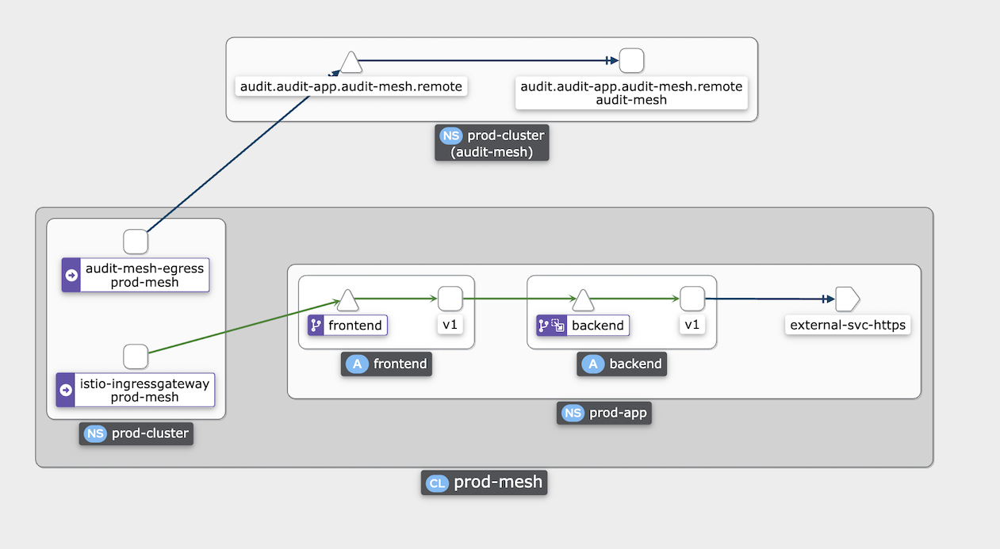

# Mirror Traffic
- [Mirror Traffic](#mirror-traffic)
  - [Setup](#setup)
    - [Prerequisites](#prerequisites)
    - [Production Cluster](#production-cluster)
    - [Audit Cluster](#audit-cluster)
  - [Configure Service Mesh Federation](#configure-service-mesh-federation)
    - [CA root certificate](#ca-root-certificate)
    - [Service Mesh Peering](#service-mesh-peering)
    - [Export/Import Services](#exportimport-services)
    - [Mirror traffic to Audit Cluster](#mirror-traffic-to-audit-cluster)
  - [Test with service outside mesh](#test-with-service-outside-mesh)

## Setup

run all-in-one script [setup-mirror.sh](setup-mirror.sh)

### Prerequisites
- Install Operators
  
  ```bash
  oc apply -f config/ossm-sub.yaml
  sleep 10
  oc wait --for condition=established --timeout=300s \
  crd/servicemeshcontrolplanes.maistra.io \
  crd/servicemeshmemberrolls.maistra.io \
  crd/servicemeshmembers.maistra.io \
  crd/kialis.kiali.io \
  crd/jaegers.jaegertracing.io
  printf "\n***** Display Operator Version *****\n"
  oc get csv
  ```

  Output

  ```bash
  customresourcedefinition.apiextensions.k8s.io/servicemeshcontrolplanes.maistra.io condition met
  customresourcedefinition.apiextensions.k8s.io/servicemeshmemberrolls.maistra.io condition met
  customresourcedefinition.apiextensions.k8s.io/servicemeshmembers.maistra.io condition met
  customresourcedefinition.apiextensions.k8s.io/kialis.kiali.io condition met
  customresourcedefinition.apiextensions.k8s.io/jaegers.jaegertracing.io condition met
  
  ***** Display Operator Version *****

  NAME                         DISPLAY                                          VERSION    REPLACES                     PHASE
  jaeger-operator.v1.34.1-5    Red Hat OpenShift distributed tracing platform   1.34.1-5   jaeger-operator.v1.30.2      Succeeded
  kiali-operator.v1.48.2       Kiali Operator                                   1.48.2     kiali-operator.v1.48.1       Succeeded
  servicemeshoperator.v2.2.1   Red Hat OpenShift Service Mesh                   2.2.1-0    servicemeshoperator.v2.2.0   Succeeded
  ```

### Production Cluster

- Create control plane for Production Cluster
    
    ```bash
    oc new-project prod-cluster
    oc apply -f config/smcp-prod-cluster.yaml -n prod-cluster
    echo "Wait for ServiceMeshControlPlane creation for maximum of 3 minutes ..."
    oc  wait --for=condition=Ready --timeout=180s smcp/prod-mesh -n prod-cluster
    oc get smcp/prod-mesh -n prod-cluster
    ```

    Output

    ```bash
    servicemeshcontrolplane.maistra.io/prod-mesh created
    Wait for ServiceMeshControlPlane creation for maximum of 3 minutes ...
    servicemeshcontrolplane.maistra.io/prod-mesh condition met
    NAME         READY   STATUS            PROFILES      VERSION   AGE
    prod-mesh    10/10   ComponentsReady   ["default"]    2.1.4    55s
    ```
    
- Create namespace for application, join namespace to control plane
    
    ```bash
    oc new-project prod-app
    oc apply -n prod-cluster -f config/smmr.yaml
    oc wait --for=condition=Ready --timeout=180s smmr/default -n prod-cluster
    oc get smmr/default -n prod-cluster
    ```

    Output

    ```log
    servicemeshmemberroll.maistra.io/default created
    servicemeshmemberroll.maistra.io/default condition met
    NAME      READY   STATUS       AGE
    default   1/1     Configured   52s
    ```

- Deploy application
    
    ```bash
    oc apply -f config/frontend-v1-and-backend-v1.yaml -n prod-app
    oc wait --for=condition=Ready --timeout=180s  pods -l app=backend -n prod-app
    oc wait --for=condition=Ready --timeout=180s  pods -l app=frontend -n prod-app
    oc get pods -n prod-app
    ```
    Output

    ```bash
    deployment.apps/frontend-v1 created
    service/frontend created
    deployment.apps/backend-v1 created
    service/backend created
    pod/backend-v1-5955bf844-7fpgc condition met
    pod/backend-v1-5955bf844-8xsv4 condition met
    pod/backend-v1-5955bf844-vrc2q condition met
    pod/frontend-v1-bdd6ddb7-ds8rf condition met
    NAME                         READY   STATUS    RESTARTS   AGE
    backend-v1-5955bf844-7fpgc   2/2     Running   0          21s
    backend-v1-5955bf844-8xsv4   2/2     Running   0          21s
    backend-v1-5955bf844-vrc2q   2/2     Running   0          21s
    frontend-v1-bdd6ddb7-ds8rf   2/2     Running   0          23s
    ```

- Create Destination Rule and Virtual Service

    ```bash
    DOMAIN=$(oc whoami --show-console|awk -F'apps.' '{print $2}')
    cat config/frontend-backend-istio-crd.yaml| \
    sed 's/DOMAIN/'$DOMAIN'/'| \
    sed 's/NAMESPACE/'prod-app'/'| \
    sed 's/CLUSTER/'prod-app'/' | \
    oc apply -n prod-app -f -
    oc get virtualservice/frontend -n prod-app
    ```
    Output

    ```bash
    NAME       GATEWAYS                        HOSTS                                                                   AGE
    frontend   ["prod-app/frontend-gateway"]   ["frontend-prod-app.apps.******.com"]   10s
    ```

- Patch frontend route that is automatically created with istio-ingressgateway service.

    ```bash
    FRONTEND_ROUTE=$(oc get route -n prod-cluster -o 'custom-columns=Name:.metadata.name'|grep prod-app-frontend)
    oc patch route $FRONTEND_ROUTE -n prod-cluster -p '{"spec":{"to":{"name":"istio-ingressgateway"}}}'
    FRONTEND_URL=$(oc get route $FRONTEND_ROUTE -n prod-cluster -o jsonpath='{.spec.host}')
    echo "\n************** You can access frontend app at http://$FRONTEND_URL **************\n"
    curl -v $FRONTEND_URL
    ```

- Verify frontend app with service mesh configured properly with Kiali
  - Kiali URL
    
    ```bash
    KIALI_URL=$(oc get route kiali -n prod-cluster -o jsonpath='{.spec.host}')
    echo "\n************** You can access Kiali of Prod Cluster at https://$KIALI_URL **************\n"
    ```
    
    Or use Developer Console

    

  - Login to Kiali
  - Select Menu Graph and enable display cluster name namespace
    
    

  - Run load test with 15 concurrent users for 10 minutes
    - Siege CLI

      ```bash
      siege -c 15 -t 10m http://$FRONTEND_URL
      ```

    - Use K6 to run load test from container

      ```bash
      oc new-project load-test
      oc run load-test -n load-test -i --rm \
          --image=loadimpact/k6 --rm=true --restart=Never \
          --  run -  < config/load-test-k6.js \
          -e URL=http://$FRONTEND_URL \
          -e THREADS=15 \
          -e DURATION=5m \
          -e RAMPUP=1s -e RAMPDOWN=0s
      ```

  - Kiali show application topology
    
    


### Audit Cluster

- Create control plane for Audit Cluster

    ```bash
    oc new-project audit-cluster
    oc apply -f config/smcp-audit-cluster.yaml
    echo "Wait for ServiceMeshControlPlane creation for maximum of 3 minutes ..."
    oc  wait --for=condition=Ready --timeout=180s smcp/audit-mesh -n audit-cluster
    oc get smcp/audit-mesh -n audit-cluster
    ```
- Create namespace for application, join namespace to control plane
    
    ```bash
    oc new-project audit-app
    cat config/smmr.yaml | sed 's/prod-app/audit-app/' | oc apply -n audit-cluster -f -
    oc wait --for=condition=Ready --timeout=180s smmr/default -n audit-cluster
    oc get smmr/default -n audit-cluster
    ```

    Output

    ```bash
    servicemeshmemberroll.maistra.io/default created
    servicemeshmemberroll.maistra.io/default condition met
    NAME      READY   STATUS       AGE
    default   1/1     Configured   2s
    ```

- Deploy audit application
    
    ```bash
    oc apply -f config/audit-app.yaml -n audit-app
    oc wait --for=condition=Ready --timeout=180s  pods -l app=audit -n audit-app
    oc get pods -n audit-app
    ```

    Output

    ```log
    deployment.apps/audit created
    service/audit created
    pod/audit-75dcc69dcf-rswqc condition met
    NAME                     READY   STATUS    RESTARTS   AGE
    audit-75dcc69dcf-rswqc   2/2     Running   0          11s
    ```
- Create destination rule and virtual service for audit app

    ```bash
    oc apply -f config/audit-istio-crd.yaml -n audit-app
    ```

## Configure Service Mesh Federation

### CA root certificate
- Get CA root certificate of prod-mesh and create configmap at audit-mesh

    ```bash
    PROD_MESH_CERT=$(oc get configmap -n prod-cluster istio-ca-root-cert -o jsonpath='{.data.root-cert\.pem}')
    echo $PROD_MESH_CERT > prod-mesh-cert.pem
    oc create configmap  prod-mesh-ca-root-cert -n audit-cluster  --from-file=root-cert.pem=prod-mesh-cert.pem
    rm -f prod-mesh-cert.pem
    oc get configmap prod-mesh-ca-root-cert -n audit-cluster -o jsonpath='{.data.root-cert\.pem}'
    ```

- Get CA root certificate of audit-mesh and create configamp at prod-mesh

    ```bash
    AUDIT_MESH_CERT=$(oc get configmap -n audit-cluster istio-ca-root-cert -o jsonpath='{.data.root-cert\.pem}')
    echo $AUDIT_MESH_CERT > audit-mesh-cert.pem
    oc create configmap  audit-mesh-ca-root-cert -n prod-cluster  --from-file=root-cert.pem=audit-mesh-cert.pem
    rm -f audit-mesh-cert.pem
    oc get configmap audit-mesh-ca-root-cert -n prod-cluster -o jsonpath='{.data.root-cert\.pem}'
    ```

### Service Mesh Peering
- Create ServiceMeshPeer [audit-mesh](config/service-mesh-peer-prod.yaml) in prod-cluster and ServiceMeshPeer [prod-mesh](config/service-mesh-peer-audit.yaml) in audit-cluster


    ```bash
    oc apply -f config/service-mesh-peer-prod.yaml
    oc apply -f  config/service-mesh-peer-audit.yaml 
    AUDIT_STATUS=$(oc get servicemeshpeer prod-mesh -o jsonpath='{.status.discoveryStatus}' -n audit-cluster | awk -F':' '{print $1}' | sed s/\{//)
    PROD_STATUS=$(oc get servicemeshpeer audit-mesh -o jsonpath='{.status.discoveryStatus}' -n prod-cluster | awk -F':' '{print $1}' | sed s/\{//)
    echo "***** Prod Cluster *****"
    oc describe servicemeshpeer audit-mesh -n prod-cluster | grep -A8 "Discovery Status:"
    echo "***** Audit Cluster *****"
    oc describe servicemeshpeer prod-mesh -n audit-cluster | grep -A8 "Discovery Status:"
    echo "Summary:"
    echo "Prod Cluster Peering Status = $PROD_STATUS"
    echo "Audit Cluster Peering Status = $AUDIT_STATUS"
    ```
    
    Output

    ```bash
    servicemeshpeer.federation.maistra.io/audit-mesh created
    servicemeshpeer.federation.maistra.io/prod-mesh created
    Prod Cluster Peering Status = "active"
    Audit Cluster Peering Status = "active"
    ```

### Export/Import Services

- Export Service in namespace [audit-app](config/service-mesh-export-service.yaml) of audit cluster

  ```bash
  oc apply -f config/service-mesh-export-service.yaml
  oc get ExportedServiceSet/prod-mesh -o jsonpath='{.status}' -n audit-cluster|jq
  oc describe exportedserviceset prod-mesh -n audit-cluster | grep -A5 "Exported Services" 
  ```

  JSON Output

  ```json
  {
    "exportedServices":[
        {
          "exportedName":"audit.audit-app.svc.prod-mesh-exports.local",
          "localService":{
              "hostname":"audit.audit-app.svc.cluster.local",
              "name":"audit",
              "namespace":"audit-app"
          }
        }
    ]
  }
  ```

  Output from oc describe

  ```
    Exported Services:
      Exported Name:  audit.audit-app.svc.prod-mesh-exports.local
      Local Service:
        Hostname:   audit.audit-app.svc.cluster.local
        Name:       audit
        Namespace:  audit-app
  ```

- Import [audit app service](config/service-mesh-import-service.yaml) to prod-app namespace

  ```bash
  oc apply -f config/service-mesh-import-service.yaml
  oc get ImportedServiceSet/audit-mesh -o jsonpath='{.status}'  -n prod-cluster|jq
  oc describe importedserviceset/audit-mesh  -n prod-cluster | grep -A5 "Imported Services"
  ```

  Output

  ```json
  {
    "importedServices":[
        {
          "exportedName":"audit.audit-app.svc.prod-mesh-exports.local",
          "localService":{
              "hostname":"audit.prod-app.svc.audit-mesh-imports.local",
              "name":"audit",
              "namespace":"prod-app"
          }
        }
    ]
  }
  ```

### Mirror traffic to Audit Cluster

- Update backend virtual service to [mirror traffic](config/backend-virtual-service-mirror.yaml) to audit app in audit cluster

  ```bash
  oc apply -f config/backend-virtual-service-mirror.yaml -n prod-app
  ```

  Check mirror configuration host that matched localService's hostname of importedServices configuration

  ```yaml 
    mirror:
      host: audit.prod-app.svc.audit-mesh-imports.local
  ```

- Run load test again and check Kiali's Graph for Prod Cluster and Audit Cluster

  Prod Cluster

  

  Audit Cluster

  

## Test with service outside mesh

Verify that pod outside both meshes cannot access service in meshes

- Create new project
  
  ```bash
  oc new-project demo
  ```

- Deploy audit app (or any deployment with curl)

  ```bash
  oc create -f config/audit-app.yaml
  ```

- Try to connect to audit service in audit-app project
  
  ```bash
  TEST_POD=$(oc get po --no-headers -o 'custom-columns=Name:.metadata.name' | head -n 1)
  oc exec $TEST_POD -- curl -s -v http://audit.audit-app.svc:8080
  ```

  Output

  ```bash
  * Rebuilt URL to: http://audit.audit-app.svc:8080/
  *   Trying 172.30.93.218...
  * TCP_NODELAY set
  * Connected to audit.audit-app.svc (172.30.93.218) port 8080 (#0)
  > GET / HTTP/1.1
  > Host: audit.audit-app.svc:8080
  > User-Agent: curl/7.61.1
  > Accept: */*
  >
  * Recv failure: Connection reset by peer
  * Closing connection 0
  command terminated with exit code 56
  ```

- Try to connect to backend service in prod-app project
  
  ```bash
  oc exec $TEST_POD -- curl -s -v http://backend.prod-app.svc:8080
  ```

  Output

  ```bash
  * Rebuilt URL to: http://backend.prod-app.svc:8080/
  *   Trying 172.30.191.238...
  * TCP_NODELAY set
  * Connected to backend.prod-app.svc (172.30.191.238) port 8080 (#0)
  > GET / HTTP/1.1
  > Host: backend.prod-app.svc:8080
  > User-Agent: curl/7.61.1
  > Accept: */*
  >
  * Recv failure: Connection reset by peer
  * Closing connection 0
  command terminated with exit code 56
  ```

